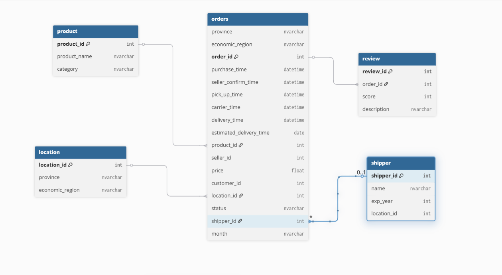
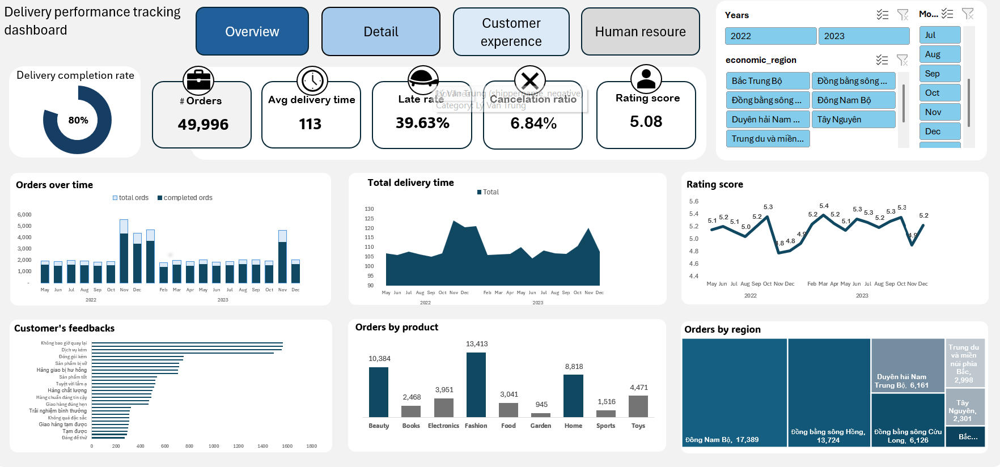
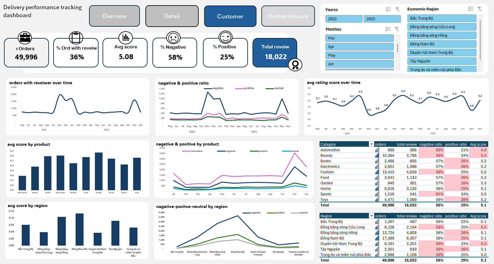
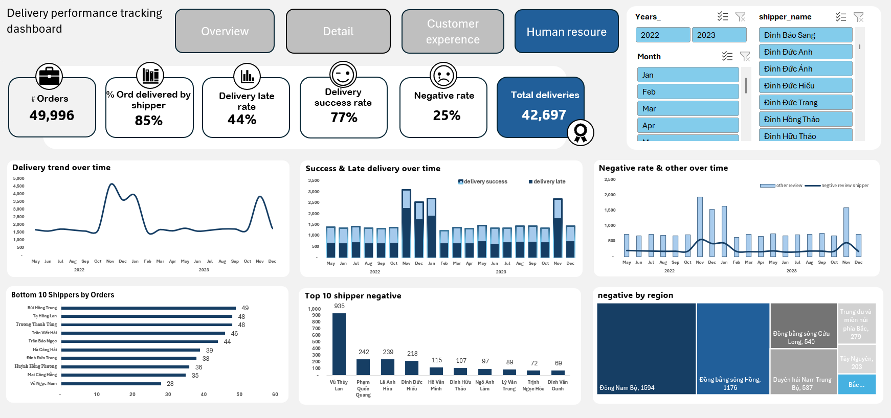

## 📊 Delivery Performance & Service Quality Dashboard

### 🔎 Project Overview
This project builds an end-to-end dashboard to monitor delivery performance and customer service quality.  
The dashboard helps stakeholders quickly track operations, detect issues, and support data-driven decisions.

---

### 🎯 Objectives

#### 1️⃣ Monitoring
- Track number of orders and reviews  
- Monitor delivery time performance  
- Analyze delivery status distribution  
- Evaluate customer rating score  

#### 2️⃣ Analysis
- Identify trends and changes over time  
- Provide multi-dimensional data insights  
- Detect underperforming areas in operations  

---

### 📌 Key KPIs
- Total Delivery Time  
- Successful Delivery Ratio  
- Late Delivery Ratio  
- Cancellation Ratio  
- Customer Rating Score  

---

### 🗂️ Data Structure

#### 🔹 Categorical
- Product Category  
- Time Type  
- Location  
- Shipper  
- Seller  

#### 🔹 Numerical
- Delivery Time  
- Score  
- Price  

---

### 📈 Visualization Approach

**Cards**
- Key metrics overview  

**Over Time Analysis**
- Bar chart  
- Line chart  

**Snapshot Analysis**
- Pie chart  
- Bar chart  
- Matrix table  
- Area chart  

**Analytical Views**
- Multi-dimensional deep dive  

---

## 🖥️ Dashboards

### 🔷 Overview Dashboard

---

### 🔷 Detail Dashboard

---

### 🔷 Customer Experience Dashboard

---

### 🔷 Human Resource Dashboard

---

## 🚀 Business Value
- Provide real-time visibility into delivery performance  
- Improve service quality monitoring  
- Support operational decision-making  
- Identify low-performing shippers and bottlenecks  
